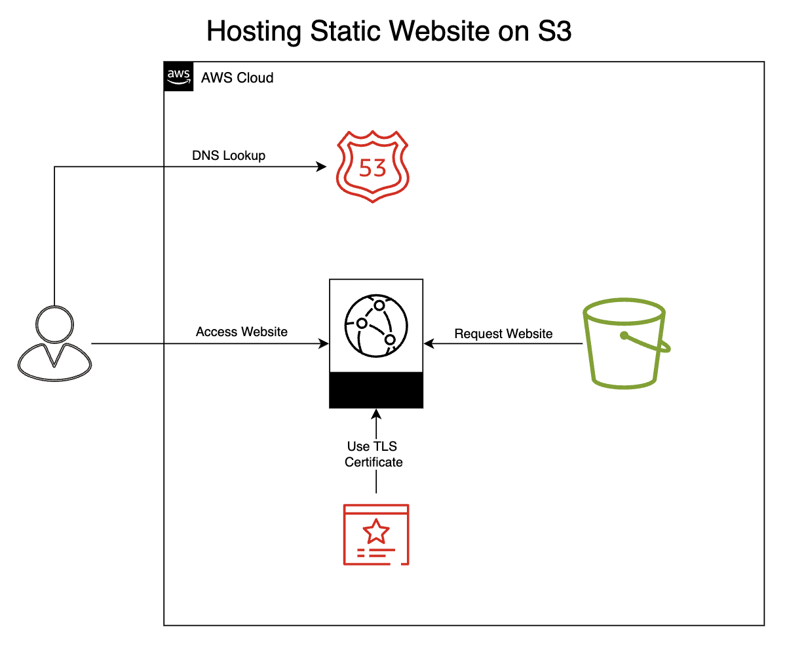

# How to Run a Static Website Hosted on S3 using AWS



## 1.Register Domain on Route 53


### In Route 53 Dashboard, click on Registered Domains


### Add the Domain name you want and Click 'Register Domain' in left menu

Once  the domain is available, add to your cart and proceed to checkout.
Provide the required contact information and complete the registration process. Once domain registered, Route 53 will automatically create a `Hosted Zone` for your domain. This is where you manage the DNS Records.
---
## 2.Set up Amazon S3 Bucket to host the Static Website
Navigate to AWS Mangemnt Console and search for `S3` and open the service.


### Create an S3 Bucket
Enter a unique bucket name that matches your domain name. Here I've used `projects-saikamat.com`.
Choose the bucket closest to the target audience in terms of region.


### Configure the bucket
After creating the bucket, click on `Properties` tab to scroll to `Static Website Hosting`. Click on `Edit` to enable static website hosting. Specify the following:-
- `index.html` as the index document, or the main HTML file.
- `error.html` for custom error pages. This is an optional step.


### Create a sample `index.html` and `style.css` files on local machine
You can use the sample ones provided in the github source code.


### Head to S3 Bucket, and uplaod these files


## Configure S3 Bucket Policy
By default, the `Make Public by ACL` in the `Actions` tab is disabled by default, because `Block Public Access` settings are enabled for the Bucket.

AWS blocks public access to S3 buckets and objects for security purposes. To resolve this, you need to adjust the bucket's public access settings and permissions.


### Head to S3 Permissions


### Untick `Block all public access` and Save changes


### Scroll Down further to edit `Bucket Policy`


### Use the following Bucket Policy and Save changes


### Test Public Access

Go to `Objects` tab of S3 bucket, and select the `index.html` file. Tap on `Copy URL` and open it in the Browser Window.

### Verify whether you can access the S3 static Web page


---
## 3. Configure Cloudfront to Distribute Website Content

Click on `Create Distribution`

### Configure Cloudfront Origin Settings

Under `Origin Domain`, select the S3 bucket from the drop-down


Under `Origin Access Control`, enable OAC to restrict direct access to the S3 Bucket.

> NOTE: Though this is optional, OAC is recommended for higher security.

## OAC Settings
OAC is modern and recommended way to allow Cloudfront to access your S3 Bucket while ensuring the Bucket isn't publicly accessible.

In the OAC Creation Dialog, enter name for the OAC, and choose `Sign Requests` as the signing behaviour. THis ensures that Cloudfront signs off requests to your S3 Bucket.


## Update S3 Bucket Policy
Once OAC is created, you need to update the S3 policy of your bucket. This will allow access originating only from Cloudfront using the OAC and not public.


Head back to S3 Bucket, permissions and `Edit Policy`.

### Use the following Bucket Policy
S3-Bucket Policy for Cloudfront OAC:-
```json
{
    "Version": "2021-10-17",
    "Statement": [
        {
            "Sid": "AllowCloudFrontAccess",
            "Effect": "Allow",
            "Principal": {
                "Service": "cloudfront.amazonaws.com"
            }
            "Action": "s3:GetObject",
            "Resource": "arn:aws:s3::::projects-saikamat.com/*",
            "Condition": {
                "StringEquals": {
                    "AWS:SourceArn": "arn:aws:cloudfront::ACCOUNT_ID:distribution/YOUR_DISTRIBUTION_ID"
                }
            }
        }
    ]
}
```

Cloudfront Distributions take 10 to 20 mintures to deploy changes.

## Configure Cloudfront Cache behaviour
- Under `Viewer Protocol Policy`, set to `Redirect HTTP to HTTPS`

- Allowed HTTP Methods, choose `GET`, `HEAD` for static websites.


## Update Route 53 DNS Records
Go back to `Route 53` and open the `Hosted Zones` and choose your domain. 

- Click on `Settings`, and add an `Alternate domain name (CNAME)` to your domain.

- Choose `Custom SSL Certificate`


## SSL Certificate
Request a Free Certificate from AWS Certificate Manager (ACM)


### Validation
ACM will ask you to validate that you own the domain. You can choose either of the two methods.

It is recommended to use `DNS Validation` , where ACM provides a DNS record that you add to your domain's DNS Settings in Route 53.


### DNS Validation
ACM will provide a CNAME record. Go to Route 53 and hosted zones


Choose your domain


Add a `CNAME` record provided by ACM to your domain's DNS Settings. The validation process takes from a few minutes to an hour.


### After creating CNAME records in ACM, you can simply create those records in route 53.


### Add SSL Certificate in Cloudfront
Go to AWS Conosle, and choose Cloudfront ad head to the distribution created before. Choose the Certificate created in ACM


## Update S3 Bucket Policy
Adding new custom SSL certificate, will update the S3 bucket policy. Update it accordingly.


##  Update Alias Record
Head back to Route 53, to the hosted zone. 

Create a new record, of type A-IPv4 Address

Enable Alias, select your created Cloudfront distribution and save the Record.


## Troubleshooting
I witnessed one tiny hiccup when lauching the website. When seemingly everything was said and done on the Cloudfront Distribution, I saw this error. 


Turns out, the "Access Denied" error you're seeing indicates that your CloudFront distribution is unable to access the content in your S3 bucket. This is a common issue when hosting a static website on AWS, and it usually happens because of one of the following reasons:

1. S3 Bucket Permissions: The S3 bucket is not configured to allow CloudFront to access its content.
2. Origin Access Control (OAC) or Origin Access Identity (OAI): If you're using OAC or OAI, the bucket policy might not be properly configured to allow CloudFront access.

---
## Key Takeaways

### 1. Domain Management with Amazon Route 53
Purpose: Route 53 is used to register and manage your domain (e.g., projects-saikamat.com).

Key Steps:
- Register a domain or transfer an existing one to Route 53.
- Create a hosted zone and configure DNS records (e.g., A or CNAME) to point to your CloudFront distribution.
> Takeaway: Route 53 ensures your domain resolves to the correct resources (CloudFront in this case).

### 2. Static Website Hosting with Amazon S3
Purpose: S3 is used to store and serve your static website files (HTML, CSS, JavaScript, images, etc.).

Key Steps:
- Create an S3 bucket with the same name as your domain (e.g., projects-saikamat.com).
- Enable static website hosting in the bucket settings.
Upload your website files to the bucket.
Configure bucket policies to allow access (either public or via CloudFront OAC).
> Takeaway: S3 provides a cost-effective and scalable solution for hosting static websites.

### 3. Content Delivery with Amazon CloudFront
Purpose: CloudFront acts as a Content Delivery Network (CDN) to distribute your website globally with low latency.

Key Steps:
- Create a CloudFront distribution with your S3 bucket as the origin.
- Configure the Default Root Object (e.g., index.html) to ensure proper routing.
- Use Origin Access Control (OAC) to securely access your S3 bucket.
Optionally enable caching, compression, and HTTPS for better performance and security.
> Takeaway: CloudFront improves website performance and security by caching content at edge locations worldwide.

<!--
## 37.


 ## 38.


## 39.


## 40.


## 41.


## 42.


## 43.


## 44.


## 45.


## 46.


## 47.


## 48.


## 49.


## 50.
 -->

