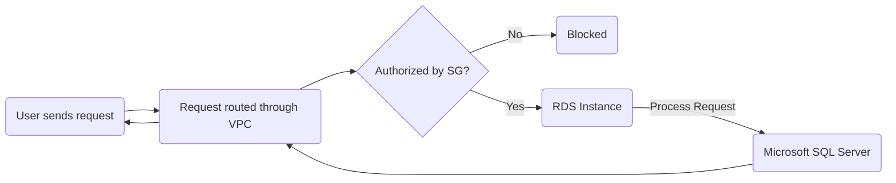

# Deploying SQL Server databases on Amazon RDS
> Swich to `assets` branch for illustrated Readme.
## Table of Contents
- [Deploying SQL Server databases on Amazon RDS](#deploying-sql-server-databases-on-amazon-rds)
  - [Table of Contents](#table-of-contents)
  - [High Level Architecture](#high-level-architecture)
  - [Workflow](#workflow)
  - [Deploy VPC](#deploy-vpc)
    - [Create VPC](#create-vpc)
    - [Create Internet Gateway](#create-internet-gateway)
    - [Create Routing Table](#create-routing-table)
  - [Create Security Group](#create-security-group)
    - [Create Inbound Rule](#create-inbound-rule)
    - [Create Outbound Rule](#create-outbound-rule)
  - [Create RDS](#create-rds)
  - [Connect to RDS Database](#connect-to-rds-database)
    - [Install Azure Data Studio](#install-azure-data-studio)
    - [Configure Connections](#configure-connections)
    - [Establish Connection](#establish-connection)
    - [Play with database](#play-with-database)
      - [Run SQL queries to interact with your database.](#run-sql-queries-to-interact-with-your-database)
      - [Create tables, insert data, and manage your database schema.](#create-tables-insert-data-and-manage-your-database-schema)
      - [Monitor and optimize database performance using tools like Performance Insights in the RDS Dashboard.](#monitor-and-optimize-database-performance-using-tools-like-performance-insights-in-the-rds-dashboard)
  - [Appendix](#appendix)
    - [Troubleshooting](#troubleshooting)

## High Level Architecture
Here, I've created a DB instance and understood important concepts relating to backups, security, scaling, optimizing, and monitoring my DB instance.

I need the following to deploy a SQL Server on RDS.
|Service|Role|
|---|---|
|Amazon RDS|managed DB service to simplify setup, operation, scaling of SQL server databases|
|VPC|secure network environment for DB|
|Security Groups|Virtual firewalls to control in & outbound traffic|
|Cloudwatch|Monitor and track RDS instance's health|
|Client Application|Used by end-user to connect to SQL Server database and send queries|

## Workflow

## Deploy VPC
### Create VPC
### Create Internet Gateway
### Create Routing Table
## Create Security Group
### Create Inbound Rule
### Create Outbound Rule
## Create RDS
## Connect to RDS Database
### Install Azure Data Studio
Since I use Mac, SSML isn't natively available to me.
Therefore I use Azure Data Studio available from [here](https://learn.microsoft.com/en-us/azure-data-studio/download-azure-data-studio?tabs=macOS-install%2Cwin-user-install%2Credhat-install%2Cwindows-uninstall%2Credhat-uninstall#download-azure-data-studio)

### Configure Connections
### Establish Connection
### Play with database
#### Run SQL queries to interact with your database.
#### Create tables, insert data, and manage your database schema.
#### Monitor and optimize database performance using tools like Performance Insights in the RDS Dashboard.
## Appendix
### Troubleshooting
Often, stopping and restarting the RDS Instance helps most connection issues.
Enable Public Access while creating RDS Instance.
| Error | Error Type | Cause | Resolution |
|---|---|---|---|
||||