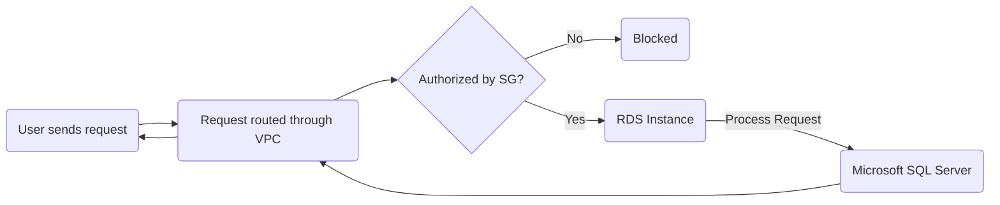

# Deploying SQL Server databases on Amazon RDS
> Swich to `assets` branch for illustrated Readme.
## Table of Contents
- [Deploying SQL Server databases on Amazon RDS](#deploying-sql-server-databases-on-amazon-rds)
  - [Table of Contents](#table-of-contents)
  - [High Level Architecture](#high-level-architecture)
  - [Workflow](#workflow)
  - [Deploy VPC](#deploy-vpc)
    - [Create VPC](#create-vpc)
    - [Create Subnet](#create-subnet)
    - [Create Internet Gateway](#create-internet-gateway)
    - [Create Routing Table](#create-routing-table)
    - [Enable DNS Hostnames (Optional)](#enable-dns-hostnames-optional)
  - [Create Security Group](#create-security-group)
    - [Inbound and Outbound Rules](#inbound-and-outbound-rules)
  - [Create RDS](#create-rds)
    - [Install Azure Data Studio](#install-azure-data-studio)
    - [Configure Connections](#configure-connections)
    - [Play with database](#play-with-database)
      - [Run SQL queries to interact with your database.](#run-sql-queries-to-interact-with-your-database)
      - [Create tables, insert data, and manage your database schema.](#create-tables-insert-data-and-manage-your-database-schema)
      - [Monitor and optimize database performance using tools like Performance Insights in the RDS Dashboard.](#monitor-and-optimize-database-performance-using-tools-like-performance-insights-in-the-rds-dashboard)
  - [Appendix](#appendix)
    - [Troubleshooting](#troubleshooting)

## High Level Architecture
Here, I've created a DB instance and understood important concepts relating to backups, security, scaling, optimizing, and monitoring my DB instance.

I need the following to deploy a SQL Server on RDS.
|Service|Role|
|---|---|
|Amazon RDS|managed DB service to simplify setup, operation, scaling of SQL server databases|
|VPC|secure network environment for DB|
|Security Groups|Virtual firewalls to control in & outbound traffic|
|Cloudwatch|Monitor and track RDS instance's health|
|Client Application|Used by end-user to connect to SQL Server database and send queries|

## Workflow

## Deploy VPC
I started with deploying a virtual private cloud which will host the setup.
### Create VPC

Go to [AWS Console](https://console.aws.amazon.com/console/home), and look for `VPC`
Set configurations as illustrated in above picture.
### Create Subnet

Head to VPC Dashboard and choose `Subnets` and `Create Subnet`

Choose the VPC you created before. We create two subnets operating in two regions -> `10.0.1.0/24` having 256 IP addresses in one availability zone, 

and `10.0.2.0/24` with another set of 256 IP Addresses in a different availability zone.
### Create Internet Gateway
When your RDS instances from inside the VPC wish to communicate with the Internet, you can use the `Internet Gateway`. 

Head to VPC Dashboard, and choose `Internet gateways` and create one.

Name it

and attach it to the VPC you created before.
### Create Routing Table
The Route Table determines how traffic is routed to your VPC. This is crucial especially if your route your traffic to the internet. 

In the VPC dashboard, head to `Route Tables` on the left, and select the route table associated with the VPC you created above.

Edit the routes, 

and choose the destination as `0.0.0.0/0` and target as the internet gateway that you already created before. This means all IPv4 traffic will be routed to the gateway.

### Enable DNS Hostnames (Optional)

If you want to use DNS hostnames to access resources inside your VPC, you enable this feature by heading to your VPC and editing the settings

and mark `Enable DNS hostnames` and `resolution` as shown above.
## Create Security Group
Configuring Security Groups (SG) is crucial since it acts as a firewall that controls in and outbound traffic to your RDS instance.

Head to EC2 in your AWS console, and choose `Security Groups` in the left tab. Choose `Create Security Group`.

### Inbound and Outbound Rules
Inbound Rules dictate what traffic is allowed to connect to your database, while Outbound Rules dictate what traffic, the database is allowed to send out. 

The inbound traffic could be SQL queries while outbound could be response to those queries.

For inbound rules, select `MSSQL` as the type. Set the source to `My IP`  if you're connecting to the databasse from your local machine. AWS automatically detects and adds your current IP address.

However if you're connecting from an application server, enter the private IP or the CIDR block of the server (e.g. `10.0.2.0./24`)

For the outbound, set it to `0.0.0.0/0` so that RDS instance can send traffic to any destination.
## Create RDS

### Install Azure Data Studio
Since I use Mac, SSML isn't natively available to me.
Therefore I use Azure Data Studio available from [here](https://learn.microsoft.com/en-us/azure-data-studio/download-azure-data-studio?tabs=macOS-install%2Cwin-user-install%2Credhat-install%2Cwindows-uninstall%2Credhat-uninstall#download-azure-data-studio)

### Configure Connections

### Play with database

#### Run SQL queries to interact with your database.

#### Create tables, insert data, and manage your database schema.

#### Monitor and optimize database performance using tools like Performance Insights in the RDS Dashboard.

## Appendix

### Troubleshooting
Often, stopping and restarting the RDS Instance helps most connection issues.
Enable Public Access while creating RDS Instance.
| Error | Error Type | Cause | Resolution |
|---|---|---|---|
||||