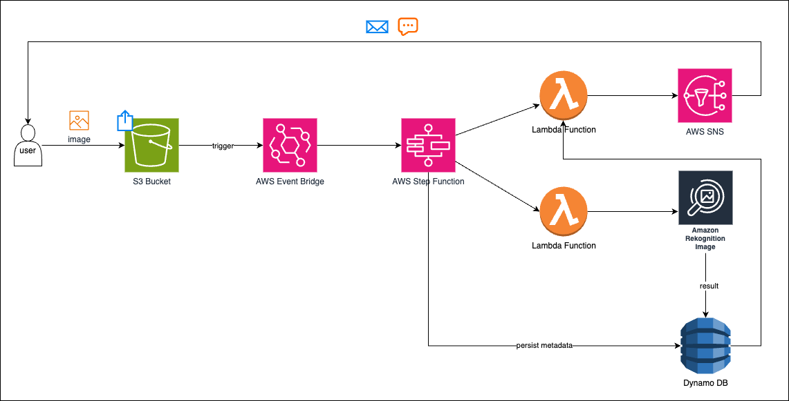

# Serverless Image processing

## Table of Contents
- [Serverless Image processing](#serverless-image-processing)
  - [Table of Contents](#table-of-contents)
  - [High Level Architecture](#high-level-architecture)
  - [1. S3 Bucket](#1-s3-bucket)
  - [2. Amazon Eventbridge](#2-amazon-eventbridge)
  - [3. Lambda Functions](#3-lambda-functions)
  - [4. Step Functions](#4-step-functions)
  - [5. Re-configure Eventbridge](#5-re-configure-eventbridge)
  - [6. Test Run](#6-test-run)
  - [7. AWS Rekognition](#7-aws-rekognition)
    - [a. Modify IAM Role](#a-modify-iam-role)
    - [b. Modify S3 Bucket Policy](#b-modify-s3-bucket-policy)
    - [c. Lambda Function](#c-lambda-function)
    - [d. Test Run](#d-test-run)
  - [6. Dynamo DB](#6-dynamo-db)
  - [7. Amazon SNS](#7-amazon-sns)
  - [Appendix](#appendix)
    - [Troubleshooting](#troubleshooting)

## High Level Architecture

1. **User Uploads an Image**: The user uploads an image to an S3 bucket.
2. **EventBridge Triggers the Workflow**: The image upload event triggers an EventBridge rule, which starts the Step Functions state machine.
3. **Step Functions Orchestrates the Workflow**: Step Functions invokes a Lambda function to process the image.
4. **Image Processing**: The Lambda function uses Amazon Rekognition to analyze the image and check for faces. The result (e.g., "Face Detected" or "No Face Detected") is stored in DynamoDB.
5. **Notification**: Another Lambda function sends a notification via SNS to inform the user of the result.
6. **User Receives Notification**: The user receives an email or SMS with the processing result.

---
## 1. S3 Bucket
The S3 Bucket acts as the storage for uploaded images. It triggers the workflow when a new image is uploaded.
Head to `console.aws.com` and look for [S3 Bucket](https://us-east-1.console.aws.amazon.com/s3/home?region=us-east-1)
<!--[image](./assets/Screenshot%202024-12-25%20at%2010.45.18.png)-->


Open `Bucket` >> `Permissions` and scroll down to `Event Notifications` as shown above. 


Make sure to set the Event Bridge notifications to `On`.

## 2. Amazon Eventbridge
Next configure the Amazon EventBridge. It detects the image upload event in the S3 bucket and triggers the AWS Step Functions state machine.

Head to AWS Console and look for `EventBridge`.


and create a new `Rule`.


In the new rule, set the type as with event pattern as shown above.

At Step 2, of building event pattern, keep the config as follows:-

| Config Type | Configuration Chosen |
|---|---|
|Event Source|AWS events of EventBridge partner events|
|Sample Event type|AWS Events|
|Creation Method|Use pattern form|
|Event Source|AWS Services|
|AWS Service|Simple Storage Service (S3)|
|Event type|Amazon S3 Event Notification|

And provide the following Event pattern:-
```json
{
  "source": ["aws.s3"],
  "detail-type": ["Object Created"],
  "detail": {
    "bucket": {
      "name": ["04-image-processing-bucket"]
    }
  }
}
```


Next when selecting the target, choose `Step Functions state machine` as the type. 

*However since there's no step function created yet, you cannot see any state machine in the drop down menu.*

>IMPORTANT - Now this is the interesting part. 
Each block in our architecture has target as the next block. It's not possible to configure EventBridge without completely configuring the next block, i.e. the Step Functions. Consequently, it's not possible to configure the Step Functions without completely configuring the Lambda functions. This is where you skip a few steps and jump directly to configuring the Lambda functions instead. You can return to configuring EventBridge later on. Let's keep this configuration as is in the current browser tab.

## 3. Lambda Functions
The Lambda functions execute the logic for:
1. Invoking Amazon Rekognition to detect faces in the image.
2. Storing image metadata in DynamoDB.
3. Sending notifications via SNS.

As discussed above, we skip a few steps here, to configure the Lambda functions first.

Create a function that is a placeholder for processing S3 Image first.


Use the default lambda function code logic with a single debug line to make sure you're on right track and then deploy it.

## 4. Step Functions
These orchestrate the workflow by coordinating the execution of multiple AWS services (e.g., Lambda, Rekognition, DynamoDB, SNS).


Head to AWS Console and look for step functions.


Provide a state name as shown in the right tab and then add the Lambda Function created in previous step to the Design workflow. Choose the `Function name` on the right as the same Lambda Function.


Once created the state machine will automatically choose a role for itself.

## 5. Re-configure Eventbridge
Now head back to the previous tab which contained the configuration for the EventBridge. Remember that this was discussed in [2. Amazon Eventbridge](#2-amazon-eventbridge).

Tap on the circular refresh icon and you should be able to see the newly created step function in the `State Machine` tab.

## 6. Test Run
We now have the following preliminary workflow ready.

The job of the test run is to ensure that the workflow works.

1. Upload image to S3 bucket


2. Check whether lambda function is invoked


Head to Lambda Function and check the metrics underneath the fucntion.


Under Cloudwatch logs, take a look at the log statements. As you can see here, the debug line inserted in sample code has also been invoked. This proves that Lambda function was called when image was uploaded.


You can trace the flow backwards, from Lambda towards Step Functions to see if the Step Function indeed invoked the Lambda function as shown above.


Continuing with backtracing, you can head to EventBridge to see when the EventBridge rule was triggered, as shown above.

## 7. AWS Rekognition
Now that we have the blocks in place, we can go on to modify the lambda function so that we can invoke AWS Rekognition. This is an AWS computer vision service that analyses the uploaded image to detect if a face is present.

### a. Modify IAM Role

Head to IAM and select the role associated with your Lambda Function.


Modify the permissions as shown above.

### b. Modify S3 Bucket Policy

Ensure the S3 bucket policy allows Rekognition and Lambda to access the images.

### c. Lambda Function
Remember that the event structure you're receiving is from Amazon EventBridge, not directly from an S3 event notification. EventBridge events have a different structure compared to the native S3 event notifications. Create your lambda function such as one created here:-
```python3
import boto3
from urllib.parse import unquote

def lambda_handler(event, context):
    # Log the event for debugging
    print(f"Event: {event}")

    # Check if the event contains the 'detail' key
    if 'detail' not in event:
        print("Error: Event does not contain 'detail'")
        return {
            'statusCode': 400,
            'body': "Invalid event structure. 'detail' key is missing."
        }

    # Extract the S3 bucket name and object key from the EventBridge event
    try:
        s3_bucket = event['detail']['bucket']['name']
        # further code below
```      

For more refer here:-
[Process Image Lambda Function](./lambdaFunctions/processImageLambdaFunction.py)

### d. Test Run

After deploying the above lamba function, test it with a sample image such as the one above.


When checking the Lambda function's cloud watch logs, you should see output as shown above.

For more refer here:-
[Face Rekognition Output](./outputs/rekognitionOutput01.json)

With this test run we have added one more block to our workflow.


## 6. Dynamo DB
## 7. Amazon SNS

## Appendix
### Troubleshooting


<!-- 


 -->


